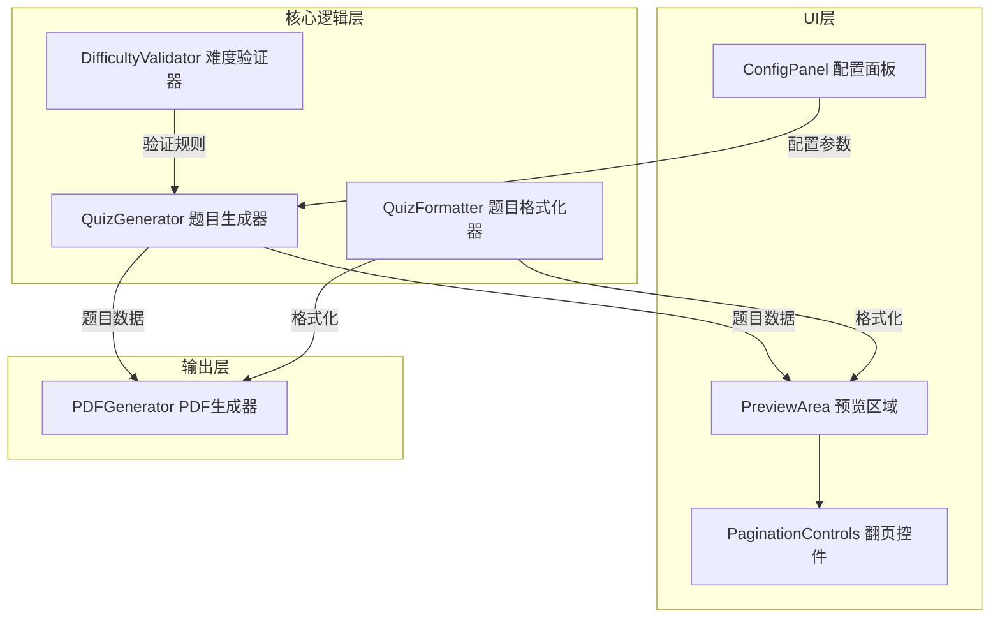
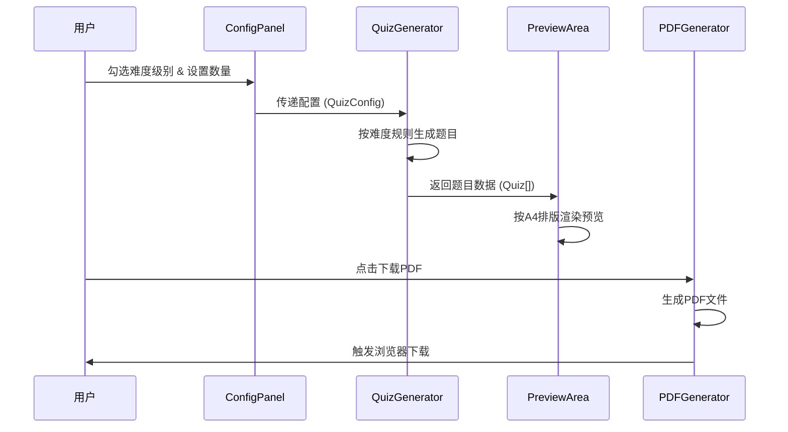

# 技术设计文档：口算出题系统（Math Quiz Generator）

## 概述

本系统是一个纯前端单页应用（SPA），面向中国小学一年级学生家长，用于生成100以内加减法口算练习题。系统采用 React + TypeScript 技术栈，无需后端服务，所有计算和PDF生成均在浏览器端完成。

核心功能包括：
- 18个难度阶梯（a-r）的口算题目生成
- 可配置的难度选择和题目数量
- A4排版预览
- PDF下载打印
- 多份批量生成

技术选型理由：
- **React + TypeScript**：类型安全，组件化开发，生态成熟
- **jsPDF**：纯前端PDF生成，无需服务端，支持中文字体嵌入
- **Vite**：快速构建工具，开发体验好

## 架构

### 整体架构

系统采用分层架构，将题目生成逻辑、UI展示、PDF生成三者解耦。



### 数据流



## 组件与接口

### 1. QuizGenerator（题目生成器）

核心模块，负责根据难度规则生成题目。

```typescript
// 难度级别枚举
type DifficultyLevel = 'a' | 'b' | 'c' | 'd' | 'e' | 'f' | 'g' | 'h' | 'i' | 'j' | 'k' | 'l' | 'm' | 'n' | 'o' | 'p' | 'q' | 'r';

// 运算符
type Operator = '+' | '-';

// 单道题目
interface Quiz {
  operands: number[];       // 操作数列表，2个或3个
  operators: Operator[];    // 运算符列表，1个或2个
  answer: number;           // 正确答案
  difficulty: DifficultyLevel;
}

// 用户配置
interface QuizConfig {
  selections: {
    difficulty: DifficultyLevel;
    count: number;           // 1-200
  }[];
  copyCount: number;         // 1-10
}

// 生成结果
interface GenerationResult {
  copies: QuizCopy[];
  warnings: string[];        // 如题目不足的警告
}

interface QuizCopy {
  copyIndex: number;         // 份数编号，从1开始
  quizzes: Quiz[];           // 该份所有题目
}

// 生成器接口
function generateQuizzes(config: QuizConfig): GenerationResult;
```

### 2. DifficultyValidator（难度验证器）

每个难度级别对应一个验证函数，用于校验生成的题目是否符合该级别的约束。

```typescript
// 难度规则定义
interface DifficultyRule {
  level: DifficultyLevel;
  label: string;              // 中文名称
  operandCount: 2 | 3;       // 操作数个数
  validate: (quiz: Quiz) => boolean;  // 验证题目是否符合规则
  generate: () => Quiz;       // 生成一道符合规则的题目
}

// 验证器注册表
const difficultyRules: Record<DifficultyLevel, DifficultyRule>;
```

### 3. QuizFormatter（题目格式化器）

负责将题目数据转换为显示字符串，以及从字符串解析回题目结构。

```typescript
// 格式化为显示字符串，如 "12 + 3 = ____"
function formatQuiz(quiz: Quiz): string;

// 格式化为纯算式字符串，如 "12+3"（用于去重比较）
function formatExpression(quiz: Quiz): string;

// 从算式字符串解析回 Quiz 对象
function parseExpression(expr: string): Quiz;
```

### 4. ConfigPanel（配置面板组件）

```typescript
interface ConfigPanelProps {
  onConfigChange: (config: QuizConfig) => void;
}
```

### 5. PreviewArea（预览区域组件）

```typescript
interface PreviewAreaProps {
  result: GenerationResult | null;
}
```

### 6. PDFGenerator（PDF生成器）

```typescript
interface PDFOptions {
  pageWidth: number;    // 210mm
  pageHeight: number;   // 297mm
  marginTop: number;    // 20mm
  marginBottom: number; // 20mm
  marginLeft: number;   // 20mm
  marginRight: number;  // 20mm
  fontSize: number;     // 14pt
  lineHeight: number;   // 2.5倍行距
  columns: number;      // 4列
  fontFamily: string;   // 微软雅黑
}

function generatePDF(result: GenerationResult, options?: Partial<PDFOptions>): void;
```

## 数据模型

### Quiz（题目）

| 字段 | 类型 | 说明 |
|------|------|------|
| operands | number[] | 操作数列表（2-3个） |
| operators | Operator[] | 运算符列表（1-2个） |
| answer | number | 正确答案 |
| difficulty | DifficultyLevel | 所属难度级别 |

### QuizConfig（用户配置）

| 字段 | 类型 | 说明 |
|------|------|------|
| selections | Selection[] | 已选难度及对应数量 |
| copyCount | number | 生成份数（1-10） |

### Selection（单项选择）

| 字段 | 类型 | 说明 |
|------|------|------|
| difficulty | DifficultyLevel | 难度级别 |
| count | number | 题目数量（1-200） |

### GenerationResult（生成结果）

| 字段 | 类型 | 说明 |
|------|------|------|
| copies | QuizCopy[] | 各份题目集合 |
| warnings | string[] | 警告信息列表 |

### 难度级别定义表

| 级别 | 名称 | 操作数个数 | 运算类型 | 数值范围 | 特殊约束 |
|------|------|-----------|---------|---------|---------|
| a | 10以内加减法 | 2 | +/- | 0-10 | 操作数和结果均在0-10 |
| b | 20以内不进位加法 | 2 | + | 10-19, 1-9 | 个位之和<10 |
| c | 20以内不退位减法 | 2 | - | 10-19, 1-9 | 被减数个位≥减数 |
| d | 20以内进位加法 | 2 | + | 1-19 | 和在11-20，个位之和≥10 |
| e | 20以内退位减法 | 2 | - | 11-20, 1-9 | 被减数个位<减数，结果>0 |
| f | 10以内连加 | 3 | +,+ | 1-9 | 三数之和≤10 |
| g | 10以内连减 | 3 | -,- | 2-10, 1-9 | 中间和最终结果≥0 |
| h | 10以内混合加减 | 3 | +/-混合 | 1-9 | 中间和最终结果在0-10 |
| i | 20以内不进位连加 | 3 | +,+ | 10-18, 1-9 | 每步个位之和<10，结果≤20 |
| j | 20以内不进位连减 | 3 | -,- | 12-19, 1-9 | 每步被减数个位≥减数 |
| k | 20以内不进位混合加减 | 3 | +/-混合 | 10-19, 1-9 | 无进位退位，结果在0-20 |
| l | 20以内进位连加 | 3 | +,+ | 1-9 | 和在11-20，至少一步进位 |
| m | 20以内退位连减 | 3 | -,- | 11-20, 1-9 | 至少一步退位，结果≥0 |
| n | 20以内进退位混合加减 | 3 | +/-混合 | 10-20, 1-9 | 至少一步进位或退位 |
| o | 两位数减一位数不退位 | 2 | - | 21-99, 1-9 | 被减数个位≥减数 |
| p | 两位数加一位数不进位 | 2 | + | 10-99, 1-9 | 和≤100，个位之和<10 |
| q | 两位数减一位数退位 | 2 | - | 21-99, 1-9 | 被减数个位<减数 |
| r | 两位数加一位数进位 | 2 | + | 10-99, 1-9 | 和≤100，个位之和≥10 |

## 正确性属性（Correctness Properties）

*属性（Property）是指在系统所有合法执行中都应成立的特征或行为——本质上是对系统应做什么的形式化陈述。属性是连接人类可读规格说明与机器可验证正确性保证之间的桥梁。*

以下属性基于需求文档中的验收标准推导而来，经过冗余消除和合并优化。

### Property 1: 难度级别约束验证

*对于任意*难度级别 L 和由 QuizGenerator 为该级别生成的*任意*题目 Q，Q 的操作数范围、运算符类型、中间结果和最终结果均应满足级别 L 定义的所有约束条件。具体包括：操作数在规定范围内、运算符类型正确、减法结果为非负整数、加法结果不超过该级别上限、连加连减的每步中间结果满足约束。

**Validates: Requirements 1.1, 1.2, 1.3, 1.4, 1.5, 1.6, 1.7, 1.8, 1.9, 1.10, 1.11, 1.12, 1.13, 1.14, 1.15, 1.16, 1.17, 1.18, 5.1, 5.2, 5.3**

### Property 2: 题目去重率

*对于任意*配置和由 QuizGenerator 生成的*任意*一份口算题集合，该份中重复题目的数量占总题目数量的比例不应超过10%。

**Validates: Requirements 1.19, 7.3**

### Property 3: 格式化往返一致性

*对于任意*合法的 Quiz 对象，将其通过 `formatExpression` 格式化为算式字符串，再通过 `parseExpression` 解析回 Quiz 对象后，应产生与原始对象等价的运算结构（操作数、运算符和答案均相同）。

**Validates: Requirements 5.4**

### Property 4: 多份独立生成

*对于任意*配置（份数 N ≥ 2），QuizGenerator 生成的 N 份口算题中，每份都应符合配置要求的难度和数量规则，且不同份之间的题目序列不完全相同。

**Validates: Requirements 7.2, 7.4**

### Property 5: 难度排序

*对于任意*包含多个难度级别的配置，生成的题目列表中，所有题目应按难度级别从低到高（a 到 r 的字母顺序）排列，即不存在排在后面的题目其难度级别低于排在前面的题目。

**Validates: Requirements 3.8**

### Property 6: 分页计算正确性

*对于任意*题目数量和份数配置，分页计算应满足：(1) 每页题目数不超过单页容量；(2) 每份口算题从新页面开始；(3) 总页数等于所有份的页数之和。

**Validates: Requirements 3.7, 4.11, 7.7, 7.8**

### Property 7: 输入验证

*对于任意*数值输入，题目数量验证函数应仅接受1到200之间的正整数，份数验证函数应仅接受1到10之间的正整数；所有不在有效范围内的值（包括非整数、负数、零、超出范围的值）均应被拒绝。

**Validates: Requirements 6.5, 7.9**

### Property 8: PDF文件名格式

*对于任意*生成时间戳，PDF文件名应严格匹配"口算练习题_YYYYMMDD_HHmmss.pdf"格式，其中日期时间部分对应实际生成时刻。

**Validates: Requirements 4.10**

## 错误处理

### 题目生成错误

| 场景 | 处理方式 |
|------|---------|
| 某难度级别可生成的不重复题目不足 | 生成该级别所有可能的不重复题目，在 `GenerationResult.warnings` 中添加警告信息，UI显示提示 |
| 用户输入无效题目数量 | 输入框旁显示红色错误提示，阻止无效值生效，保持上一个有效值 |
| 用户输入无效份数 | 同上，份数输入框旁显示错误提示 |

### PDF生成错误

| 场景 | 处理方式 |
|------|---------|
| 字体加载失败 | 回退到系统默认无衬线字体，在控制台输出警告 |
| PDF生成过程异常 | 捕获异常，显示用户友好的错误提示（如"PDF生成失败，请重试"） |
| 无题目时点击下载 | 按钮禁用状态，显示"请先选择难度类型"提示 |

### 输入验证规则

| 输入项 | 有效范围 | 验证时机 |
|--------|---------|---------|
| 题目数量 | 1-200 正整数 | 输入变化时实时验证 |
| 生成份数 | 1-10 正整数 | 输入变化时实时验证 |

## 测试策略

### 测试框架选型

- **单元测试**：Vitest（与Vite生态集成，速度快）
- **属性测试**：fast-check（JavaScript/TypeScript 最成熟的属性测试库）
- **组件测试**：React Testing Library + Vitest

### 属性测试（Property-Based Testing）

每个正确性属性对应一个属性测试，使用 fast-check 库实现。每个测试至少运行100次迭代。

每个属性测试必须以注释标注对应的设计属性：

```typescript
// Feature: math-quiz-generator, Property 1: 难度级别约束验证
test.prop([fc.constantFrom(...ALL_LEVELS), fc.integer({min: 1, max: 50})], 
  (level, count) => {
    const quizzes = generateForLevel(level, count);
    quizzes.forEach(q => expect(difficultyRules[level].validate(q)).toBe(true));
  }
);
```

属性测试覆盖范围：

| 属性 | 测试描述 | 生成器策略 |
|------|---------|-----------|
| Property 1 | 随机选择难度级别，生成题目，验证所有约束 | `fc.constantFrom(...levels)` 选择级别 |
| Property 2 | 随机配置生成题目，检查重复率 | `fc.integer` 生成数量 |
| Property 3 | 随机生成合法Quiz对象，验证格式化→解析往返 | 自定义Quiz arbitrary |
| Property 4 | 随机配置多份生成，验证每份正确性和份间差异 | `fc.integer({min:2, max:10})` 生成份数 |
| Property 5 | 随机选择多个难度级别，验证排序 | `fc.subarray` 选择级别子集 |
| Property 6 | 随机题目数量和份数，验证分页计算 | `fc.integer` 生成数量和份数 |
| Property 7 | 随机生成各种数值输入，验证验证函数 | `fc.oneof(fc.integer, fc.float, fc.string)` |
| Property 8 | 随机生成时间戳，验证文件名格式 | `fc.date` 生成日期 |

### 单元测试

单元测试聚焦于具体示例、边界情况和集成点：

- **各难度级别的边界值测试**：如级别a的 0+0、10-0 等边界情况
- **题目不足时的警告测试**：如级别f请求200道但可能的不重复题目有限
- **UI组件交互测试**：勾选/取消勾选、输入框显示/隐藏、按钮禁用状态
- **PDF生成集成测试**：验证PDF文件可正常生成
- **配置面板默认值测试**：默认数量50、默认份数1
- **debounce行为测试**：配置变更后500ms内更新预览

### 测试组织

```
src/
├── __tests__/
│   ├── quiz-generator.test.ts        # QuizGenerator 单元测试
│   ├── quiz-generator.property.ts    # QuizGenerator 属性测试
│   ├── quiz-formatter.test.ts        # QuizFormatter 单元测试
│   ├── quiz-formatter.property.ts    # QuizFormatter 属性测试（往返）
│   ├── pagination.test.ts            # 分页计算单元测试
│   ├── pagination.property.ts        # 分页计算属性测试
│   ├── validation.property.ts        # 输入验证属性测试
│   ├── pdf-filename.property.ts      # PDF文件名属性测试
│   └── components/
│       ├── ConfigPanel.test.tsx       # 配置面板组件测试
│       └── PreviewArea.test.tsx       # 预览区域组件测试
```
